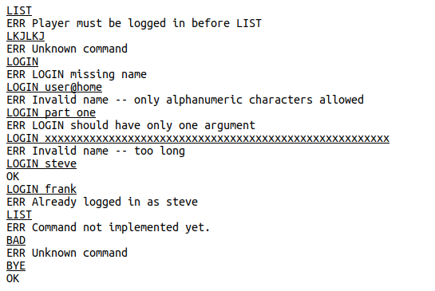

# CSC 362 Project - Spring 2023

## Project description

This repository is for your three-part CSC 362 project, for which you
will create a multi-threaded, networked, multi-arena game
server. Players will be able to connect to the server, move between a
lobby and different "arenas," and send messages to other users. Your
code will keep track of which players are in which room, will have a
separate thread for interacting with each player, and will have a
"notification manager" thread to send messages and announce arrivals
and departures for the arenas. You won't be making an actual game --
just the player management part.

The project will proceed in three two-week long assignments (the last
one is actually 13 days, to avoid an assignment being due on Reading
Day). Specific due dates are in Canvas and in the description
below. There are YouTube videos with links in Canvas demonstrating the
operation of each part of the project. Watch those, which should
clarify any questions you have about what the server should do in
different situations.

This assignment is different from the assignments you have been doing
in a few fundamental ways:

* While you may communicate and collaborate (in a limited way) with
  others on the weekly assignments, this project is for you to
  complete *on your own*. The purpose is for you to demonstrate what
  you have learned and what you can do in a system programming
  setting, and your work on this project should not be discussed with
  other students. If you run into issues, you can ask questions of the
  instructor.

* While some code will be provided to you, the programming tasks are
  larger and more in-depth than your weekly assignments. The project
  does draw heavily on previous class examples and weekly assignments,
  so make sure to think about what previous code you can re-use and
  integrate that into your project.

* To make sure you can proceed to later parts of the assignment, since
  each part builds upon the previous one, the instructor solution for
  parts 1 and 2 will be released after the late submission date for
  each part has passed. For example, Part 1 is due on Thursday, March
  30, and Part 2 is due on Thursday, April 13 -- on Friday morning,
  April 7, the instructor solution for Part 1 will be released on
  GitHub. If you struggle with Part 1 or Part 2, you'll have a week to
  either use ideas from the posted solution to improve your code, or
  you can simply use the instructor solution in its entirety. You'll
  lose a week of working time if you start from that code, but if you
  can't rescue your work from a previous part this might be the best
  way for you to move forward.

* To indicate solutions to different parts, we'll use standard
  techniques that developers use to label versions of a software
  project. In particular, you will use Git "tags" to label a specific
  commit for grading, and when you have finished with part 1 you'll
  label it as version 0.1. Part 2 will be version 0.2 and the final
  project will be version 1.0. Here's the process: Let's say you have
  finished work on Part 1. You would **commit and push your repo as
  usual**, and **after that** you issue these two commands:

   ```
      git tag -a v0.1 -m "Finished with Part 1"
      git push origin v0.1
   ```

   The parts in that previous paragraph that are in bold are **very
   important**. You *must* push the code first, and *then* you tag it
   with a version number. The "push" in the commands above will not
   push any code at all, only the tag, so if you don't do the regular
   commit and push first then none of your code will be submitted (and
   you'll get a zero on the assignment). Note that you must push
   the tag separately, with the slightly longer `git push` command --
   it will not get pushed with the normal `git push` command. Once you
   do this, we will assume that your project is final and ready for
   grading. In the GitHub web interface to your repo, you'll notice a
   "tag" link above the files, next to the branches. You can click on
   that to verify that your tag was properly pushed to GitHub.

## High-Level Project Overview

As described above, the end product of this project will be a network
game server that keeps track of players and various areas (a lobby
and four arenas) for the game to take place. Each player is a network
client that connects to the server, which keeps track of where players
are and sends notifications to the players as necessary. The project
will be accomplished in three phases -- the first of which does not
involve threads or networking at all, so we'll build up capabilities
slowly. The full application-level protocol (the "language" for
speaking to the server) is defined in the final section of this
README, and while you won't implement it all at once you should read
through it carefully before you start coding on Part 1.

**Important:** The server is *not* a program that interacts with a
human user. While that's the way you'll test it, the design is for a
server program that talks with client *programs* that players would
use in a real system. What this means is that the communication must
be *EXACTLY* as defined in the section "Application Layer Protocol"
below. Do not improvise! Do not add extra "helpful" output or prompts
or "welcome" messages or anything like that. While those might be
useful for a program that interacts with a human, it is incorrect in
an application level protocol that must follow the definition
precisely so that different programs can interact with each other.

**Quality reminder:** While there's a lot of functionality to
implement here, keep in mind that in a 300-level class (and even more
so in the work world!), you're expected to write *good* code, which
means good style, good design, and good documentation. Your code should be
robust (handling errors gracefully) and should manage memory
properly. Remember to check with Valgrind to make sure you don't have
any memory leaks, and carefully think through how things can go wrong.

**Project difficulty:** The project requires you to write a
non-trivial amount of code, as compared to the weekly assignments. Get
started on each part as soon as you can so you don't run out of time!
In order to gauge the difficulty of each part and what is expected,
here are the number of new lines of code that were added for each part
in the instructor's solution (not counting comments or re-used code):

* Part 1: 73 lines of code
* Part 2: 120 lines of code
* Part 3: 190 lines of code

Of course, lines of code don't tell the entire story. There are thread
management issues that come up that need to be carefully thought
through, so it's not just a matter of cranking out lines of code.

## Part 1 (v0.1): Creating the basic command processor (due Thurs, March 30)

For the first part of the project development, you should spend some
time studying the "Application Layer Protocol" given below as well as
the provided code so that you understand how everything is
designed. At this point there is no networking, and only one player
will "talk" with the server using console I/O, and the provided "main"
function in `arena.c` sets this up. The string parsing code in the
`docommand` function in `arena_protocol.c` is particularly important
to study and understand. Once you've got a good understanding of what
has been provided, you are to expand the code so that it recognizes
all of the commands in the final application layer protocol, although
only "LOGIN" and "BYE" need to be fully implemented. For the others,
simply put in a check to make sure the player is registered, and give
an appropriate error message if they are not. If the player *is*
registered, just output an "ERR" message saying the command is not
implemented yet.

For the "LOGIN" command, you need to make sure the player is not
already logged in, that an argument was given, that the argument is in
the right form (all alphanumeric characters), and is within the length
bound. If any of these conditions is not met, output an error
message. To check characters in the string, see the man page for
`isalnum`. If everything is OK, then copy the name into the `name`
field of the `player_info` struct, change the state appropriately, and
respond with an "OK" message. Since there will only be a single player
interacting with the server in this part, you cannot check whether the
player's name is already taken -- that will come in Part 2! The
following transcript shows how the program should behave in v0.1,
where client (typed) input is underlined, and other lines come from
the server. Notice that it recognizes actual commands, even if it
doesn't implement them, and recognizes whether the player is
logged in or not.



You also need to implement the "BYE" command, which simply sets the
player state to `PLAYER_DONE` which will exit the loop in `main`.

## Part 2 (v0.2): Network server and communication threads (due Thurs, April 13)

For the second phase of the assignment, you should implement the
networking part of the project, and build a player tracking list
using a provided generic thread-safe arraylist to keep track of
players. To get the arraylist implementation, get the "C-ArrayList"
repository from the class organization. Copy the `alist.h` and
`alist.c` files from that repository directly into the `src` directory
of your project, update your `Makefile`, and then do a `git add` so
they are included in your project.

From a networking standpoint, for a player to join the system, they
connect to the server using a TCP stream on server port 8080. Each
connection corresponds to a different player and should be handled in
its own thread. The "read loop" that was provided to you for Part 1
should be moved from `main` into the thread handler, since each
connection needs its own read loop. The main program will then be the
basic TCP server setup and listener code, just like the examples in
class. Here are a few important points to guide your development:

* A connection should be cleanly shut down when either the server
  receives a "BYE" command or the client disconnects (which you can
  detect by a failed `getline` call). That means that the lifetime of
  each thread is unpredictable, and using `pthread_join` to clean up
  after these threads is difficult. However, you can't just ignore
  this, or the thread will hold on to some resources as a "thread
  zombie," and you'll have a memory leak! An easy way to solve this
  problem is to call `pthread_detach()` in each thread after it
  starts. This basically says that when a thread is finished, all
  resources can be freed up, and it will not create a zombie
  thread. Check the `pthread_detach` man page for usage info.

* In part 1, the single session was connected to the `stdin` and
  `stdout` streams. In this part, you need to set the `fd_send` and
  `fd_recv` file handles after accepting a network connection. These
  should be separate, independent sending and receiving file handles,
  and yet `accept()` only creates a single socket file descriptor for
  both reading and writing. The right way to handle this is to call
  `dup()` on the file handle given by `accept()` to get two
  kernel-level file descriptors, and then use `fdopen` twice to
  create FILE objects on each file descriptor -- one just for reading
  (for `fd_recv`), and one just for writing (for `fd_send`). These
  should be set in the `player_info` structure when it is initialized so
  that subsequent I/O goes to the right place.

* Buffering in a FILE stream can be awkward, but since this is a
  line-oriented protocol the file handles can be set to be line
  buffered to avoid problems. See the `setvbuf()` function for how to
  do this.

As mentioned above, you also need to incorporate the provided
thread-safe, generic array list to keep track of players. You
should use this to maintain a list of `player_info` structs, and I would
suggest (although not require) that you create a new module in your
project that manages this list of players. The rest of the program
then would never touch the "alist" type at all, but would call
functions in your new module every time a list operation needs to be
performed. Whenever a new client connects, part of the client
initialization should include adding the initialized `player_info` struct
to a global list of all players in the system. You should also create a
function that searches the list for a specific name, and using that
you should modify the "LOGIN" command to give an error message if a
player tries to log in with the same name as an existing player.

There are many subtle race conditions that must be considered for your
program to be truly thread-safe. It is really hard to eliminate
all these issues (or even reliably detect them in testing), so your
projects will not be graded harshly for these issues. However, while
these might *seem* unlikely to occur, they are important -- if you
were producing professional-grade software (which many of you may be
doing in a few years!) then releasing something that has one of these
"seemingly unlikely" bugs in it is something that could cost your
company a lot of money and/or grief. Consider:

* What if one thread is in the process of changing a name (because
  of a "LOGIN" command) while another thread is scanning the list
  looking for a particular name?

* What if a new player is being added to the list, or a player is being
  removed from the list, while another thread is iterating through the
  list looking for a name?

* What if two players disconnect around the same time and they are
  both being removed from the list at the same time? Since the
  arraylist removes items by their position in the list, could a
  player that started out being in position 6 be in position 5 before
  the end of the operation (so you end up removing the wrong player)?

The bottom line is this: you shouldn't be able to scan or modify the
list if some other thread is modifying either the list structure or
the names on the list. An easy protection for this is to include a
global lock that protects the global player list. Using read/write
locks, as introduced in the Weekly09 extra credit, is more efficient
than using mutex locks.

## Part 3 (v1.0): Completing the server (due Wed, April 26)

For this part, you need to complete the game server, bringing it up to
v1.0 -- ready to release to the world! The big addition here is adding
a "notification manager" that runs in its own thread, using a queue to
accept notification jobs from the networking threads. Once that is in
place, you will complete the remaining commands for the application
layer protocol.

Why do we use a separate thread for sending notifications? Because,
ideally, a network server should be very *responsive* to clients,
accepting and responding to requests very quickly. After LOGIN, during
an active session, we would like every algorithm to run in O(1) time
before giving a response to the client. However, sending a
notification, whether to an individual user or to an entire room, is a
Θ(n) time operation since it requires scanning the full list of
players. In order to keep our network communication threads
responsive, we pass off all notifications to a separate thread using a
queue of notification requests. So when a player moves to a new room,
we want to simply add a request to the notification queue, which takes
O(1) time, and then send the response to the client. The notification
takes place later, when the notification manager thread dequeues and
handles the request. This is a common design for many programs, where
the queue is generically called a "job queue."

There are two exceptions to our rule about client requests being
handled in O(1) time: During login, the player list must be scanned to
see if a name is already in use, but if a login takes a little longer
it's not such a big deal. The second exception is for the LIST
command, where the list must be constructed and sent back with the
response line from the server. We could have designed this as a
response that could be handled by our notification manager as well, but
that needlessly complicates this class project. It's the right way to
do it though!

Finally, in addition to the notification manager, you should finish
implementing the remaining commands: LIST, STAT, MOVETO, and MSG. The
last two use the notification manager to send messages, so you'll need
the notification manager working before you can finish those.

## The Application Layer Protocol

The game server uses a line-based application-layer network
protocol. Players connect to the server, and messages between the
player and server (in both directions) are single lines of text. A
player can make a request (e.g., move to a specific arena) using a
line in which the first word is a command, possibly followed by
optional arguments as described below. The status of a player, and
all the data necessary for communication between the server and the
player, is stored using the `player_info` data type, defined in
`player.h`. The provided structure definition has everything you need
for Part 1 of the assignment, but you may need to add additional
fields for later parts.

At any point in time, every player that is part of the system has a
current state, which is one of three possible values. These values are
defined in `player.h` and the current state for each player in the
`state` field of the `player_info` structure. The states are as follows:

* `PLAYER_UNREG` - the initial state of a player when it contacts the
  game server, meaning that the player is unregistered and has not
  provided a name yet. The player must "log in" and provide a name
  before any other command will be accepted (note that there are no
  passwords, so "logging in" means just providing a name).

* `PLAYER_REG` - this is the state of an active, logged-in player. All
  commands other than `LOGIN` require a player to be in this state.

* `PLAYER_DONE` - this is a special state in which the player has
  indicated that they are leaving the game. No more commands are
  accepted for a player in this state, and the network connection will
  be terminated.

There are six commands or requests that a player can send to the game
server. Each command is sent on a single line from the player to the
server, with a command *exactly* as listed below (including
capitalization) and any necessary arguments on the same line separated
by at least one space from the command. When the server receives a
command, it will always respond with a line that starts with either
the word "OK" or the word "ERR", followed by a human-readable single
line description or comment. For example, if the player issues the
command "LOGIN fred#1" then the server could respond with

```
ERR Invalid name -- only alphanumeric characters allowed
```

Here is a complete list of commands that the player can send to
the game server:

* `LOGIN name` \
  Register the player with the given name, where name must be an
  identifier for the player that is not currently in use (each player
  must have a unique name). The name must be a single word (no spaces)
  consisting of only alphanumeric characters. It can be at most
  `PLAYER_MAXNAME` characters long (defined in `player.h`). A command
  with a missing or invalid name must be rejected by the server as an
  error. This command can only be issued if the player is in the
  `PLAYER_UNREG` state, and success will result in the player being
  transitioned to the `PLAYER_REG` state.

* `MOVETO arena#`\
  This request takes a single numerical argument giving an "arena
  number" that the player would like to move to. Arenas are numbered
  0-4, where arena 0 is a special place called the "Lobby". When a
  player moves from one arena to another, the system notification
  manager should send out a notification to everyone in the room that
  the player is leaving and another notification to everyone in the
  room that they player is joining, saying "(playername) has
  left/joined arena #". However, the notification should never say
  "arena 0" -- it should always say "the lobby" in that case.

* `MSG user message`\
  This request requires two arguments, the name of a user to send a
  message to, and a message to send. You should use the notification
  manager thread to actually send the message, as described above in
  "Part 3."  If there is no user by the requested name in the system,
  it's OK for this command to fail silently (i.e., no notification to
  the sender).
  
* `STAT`\
  This request (with no arguments) should give a response of "OK #",
  where # is the arena number (0-4) where the player is currently
  located.
  
* `LIST`\
  This request (with no arguments) results in the server returning
  "OK" followed by a comma separated list of players in the same room as
  the requesting player.
  
* `BYE`\
  This command is issued by a player to disconnect from the
  server. The player's state should be set to `PLAYER_DONE`, the
  communication should be shut down, and resources free'd.

In addition to the "OK" and "ERR" responses to player requests, the
server can send the following message to a player:

* `NOTICE`\
  This indicates a message for the player, which could include
  notifications about players leaving or entering the room with the
  player, or messages sent from other players. For example, if user
  "alice" sends the message "Hi Bob!" to user bob, then use bob will
  receive the following:
  ```
  NOTICE From alice: Hi Bob!
  ```
